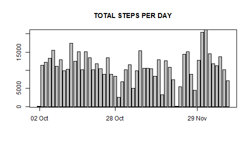
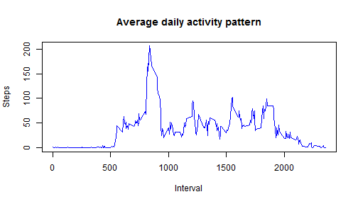
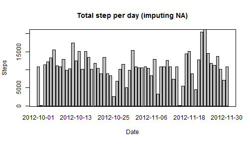

# Loading and preprocessing the data 
    The first step consists in loading the data, getting rid of the N.A value, and coercing the date by `as.DATE`

```r
setwd("C:/Users/trand_000/Desktop/Coursera Data/reproductible research/RepData_PeerAssessment1")
activityOld <- read.csv("activity.csv")
activityOld$date <- as.Date(activityOld$date, "%Y-%m- %d")
activity <- activityOld[!is.na(activityOld$step), ]
head(activity)
```

```
##     steps       date interval
## 289     0 2012-10-02        0
## 290     0 2012-10-02        5
## 291     0 2012-10-02       10
## 292     0 2012-10-02       15
## 293     0 2012-10-02       20
## 294     0 2012-10-02       25
```
# What is mean, median and total number of steps taken per day?
##  Calculate total number of steps per day

```r
    sum<- tapply(activity$step, activity$date, sum)
```
## Histogram    

```r
    barplot(height=sum, names=("")) 
    title("TOTAL STEPS PER DAY")
    box()
    axis(1, at=c(1,26,53), lab=c("02 Oct","28 Oct","29 Nov"))
```

 
   
## Mean and median

```r
    mean<-mean(sum) 
    median<- median(sum)
```
    The mean of total step per day is 1.0766189 &times; 10<sup>4</sup>. The median is 10765
# What is the average daily activity pattern?
## Make a time series plot of the 5-minute interval (x-axis) and the average number of steps taken, averaged across all days (y-axis)
    Calculate the pattern by interval

```r
    patt <- aggregate(activity$step ~ activity$interval, 
                  data=activity, FUN="mean")
    head(patt)
```

```
##   activity$interval activity$step
## 1                 0     1.7169811
## 2                 5     0.3396226
## 3                10     0.1320755
## 4                15     0.1509434
## 5                20     0.0754717
## 6                25     2.0943396
```
    The time seris plot

```r
    plot(patt, type="l", main="Average daily activity pattern", 
        xlab="Interval", ylab="Steps")
    lines(patt, col="blue")
```

 

## Which 5-minute interval, on average across all the days in the dataset, contains the maximum number of steps?

```r
    max<-match(max(patt[,2]), patt[,2])
    max<-patt[max,1]
```
    The 5-minute interval containing the maximu number of stap is 835
# Imputing missing values
  Note that there are a number of days/intervals where there are missing values (coded as NA). The presence of missing days may introduce bias into some calculations or summaries of the data.
##Calculate and report the total number of missing values in the dataset (i.e. the total number of rows with NAs)

```r
    u<- is.na(activityOld)
    na<-sum(u)
```
    The total number of missing values in the dataset is 2304
## Filling the Dataset
    I'll fill the missing value by the mean for that 5-minute interval

```r
    activityNew<- activityOld
    aves <- aggregate(activityNew$step ~ activityNew$interval, 
                  data=activityNew, FUN="mean")
    for (i in 1:nrow(activityNew)){
        if (is.na(activityNew[i, 1])) {
            position<-match(activityNew[i, 3], aves[,1])
            activityNew[i,1]<- aves[position, 2]
        }
    }
    head(activityNew)
```

```
##       steps       date interval
## 1 1.7169811 2012-10-01        0
## 2 0.3396226 2012-10-01        5
## 3 0.1320755 2012-10-01       10
## 4 0.1509434 2012-10-01       15
## 5 0.0754717 2012-10-01       20
## 6 2.0943396 2012-10-01       25
```
## Histogram of the total number of steps taken each day 


```r
    sumNew<- tapply(activityNew$step, activityNew$date, sum)
    barplot(height=sumNew, main="Total step per day (imputing NA)", xlab="Date", ylab="Steps")
    box()
```

 
## Calculate and report the mean and median total number of steps taken per day.

```r
    meanNew<- mean(sumNew) 
    medianNew<- median(sumNew)
    print(meanNew)
```

```
## [1] 10766.19
```

```r
    print(medianNew)
```

```
## [1] 10766.19
```
    The 'old' mean and 'old' median are 1.0766189 &times; 10<sup>4</sup>, 10765. There are no huge difference between these values 
# Are there differences in activity patterns between weekdays and weekends?
## "Weekday" or "Weekend"?
Create a new factor variable in the dataset with two levels - "weekday" and "weekend" indicating whether a given date is a weekday or weekend day.

```r
    library(lubridate)
    date<- wday(activityNew$date)
    u<- date==1|date==7
    activityNew["weekend"]<-u
```
## Plot
Make a panel plot containing a time series plot (i.e. type = "l") of the 5-minute interval (x-axis) and the average number of steps taken, averaged across all weekday days or weekend days (y-axis). See the README file in the GitHub repository to see an example of what this plot should look like using simulated data.

```r
    pattWday<- aggregate(activityNew$step, list(interval= activityNew$interval, 
                                             weekend=activityNew$weekend==TRUE), 
                    FUN= "mean")
    for (i in 1:nrow(pattWday)){
        if (pattWday[i,2]==TRUE) {
            pattWday[i,2]<- "weekend"
        }
    else
            pattWday[i,2]<-"weekday"
    }
    library(lattice)
    xyplot(pattWday$x~pattWday$interval|wk, data=pattWday, layout=c(1,2), 
           type="l", xlab="interval", ylab="Number of step")
```

```
## Error in eval(expr, envir, enclos): object 'wk' not found
```
